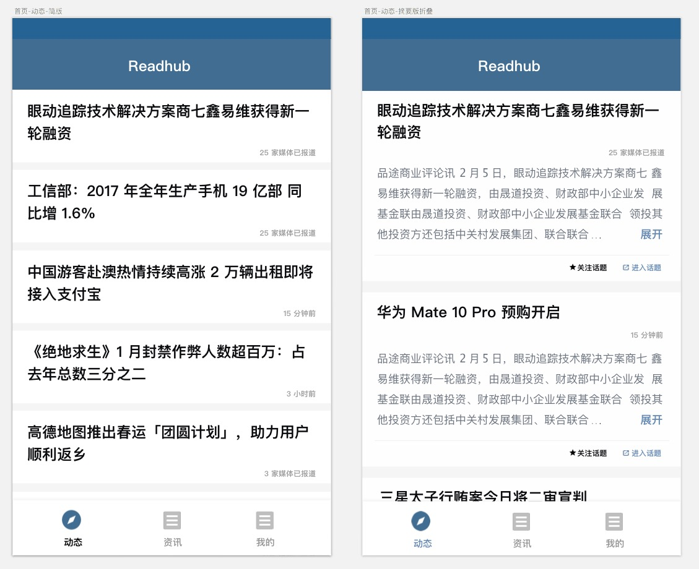
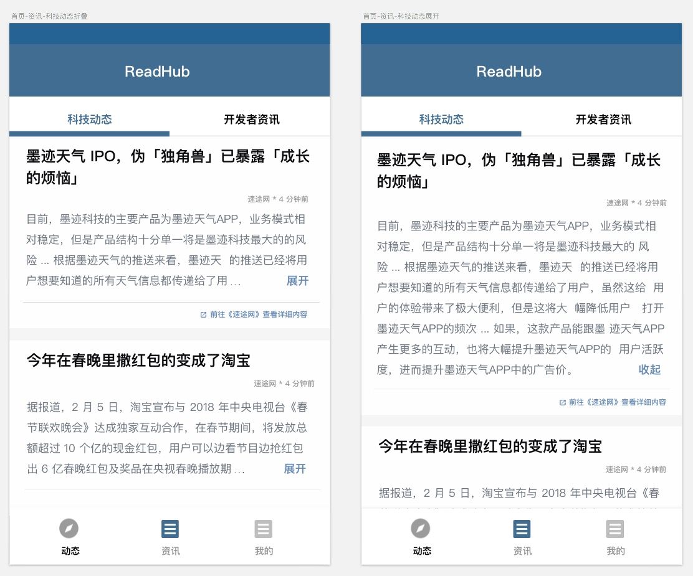
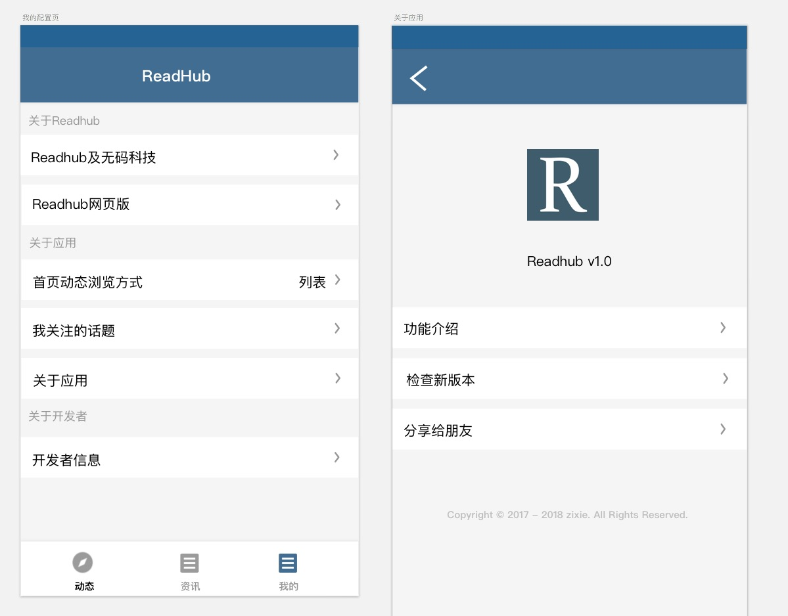

# Readhub-Android

## 项目简介

- 应用介绍

	**该应用非无码科技官方产品，仅是基于个人兴趣开发的一款浏览Readhub内容的Android应用。app内所有资讯内容均来自无码科技产品 Readhub。**

- Readhub 介绍：
 
	Readhub 是无码科技团队的一个副产品。这个产品有什么用？每天花几分钟了解一下互联网行业里发生的事情。行业里，每天值得关注的事情，可能并不超过 5 件，其他的信息都是可读可不读的。无码科技团队想通过技术和产品的手段，把每天获取资讯这个事情做得优雅一点。

	以上内容均来自微信公众号「小道消息」，关于 Readhub 的更多介绍，可以点击链接[无码科技发布第一款产品](https://mp.weixin.qq.com/s?__biz=MjM5ODIyMTE0MA==&mid=2650969398&idx=1&sn=70c44b9bb994d9a8d98453b97555890b&chksm=bd38310d8a4fb81b878d2a252e813b304873412d2131d7e4787efb52f68ca8676eaad89bd245&scene=0&key=afcd625aa1116852d5c1c05e8cc727fbb36dd1a1b29b2d479b7102b73bafb061942b0a8684a5d01354a97047e79d47a8f18b6757d69cfc201f1088dbe061eef3a801718c08ecf740af13f55f3f3e7e65&ascene=0&uin=OTk0NDIyNDgw&devicetype=iMac14%2C2+OSX+OSX+10.12.4+build(16E195)&version=12020610&nettype=WIFI&fontScale=100&pass_ticket=z4VWnrxOnq2HBP%2BrcsexXO%2F5kXUdPvn9hiTeEgb9DUGwzmC8y%2BNyqBW3b9SjanRq) 查看！

## 产品体验

### 下载地址

- 扫码下载

	敬请期待

- 直接下载

	敬请期待

### 应用效果

- 首页热门话题：

	

- 首页资讯：

	

- 首页我的：

	
	
## 版本内容 — v2.0

- 新的代码框架

- 新的页面风格

- 增加浏览记录

- 提升用户体验
	
	- 预下载提升页面打开速度
	
	- 支持断网条件下离线访问 

## 开发体验

### 运行方法

开发中版本，暂无完整版本的体验运行方法。如果想体验开发中版本，请参考本人博客：[终端基于gradle的开源项目运行环境配置指引](
http://blog.bihe0832.com/android-as-gradle-config.html)

### 项目介绍

新版本采用模块化 + 页面路由的方式来开发。具体用到的框架后续会陆续补充。

#### 框架介绍

#### 代码目录

