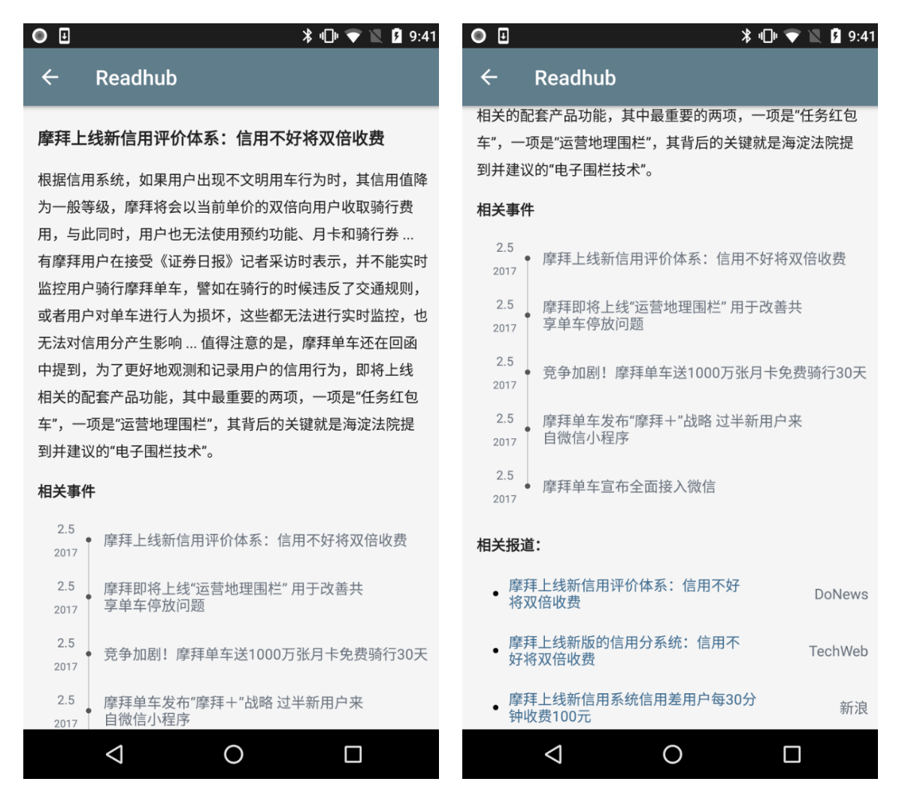
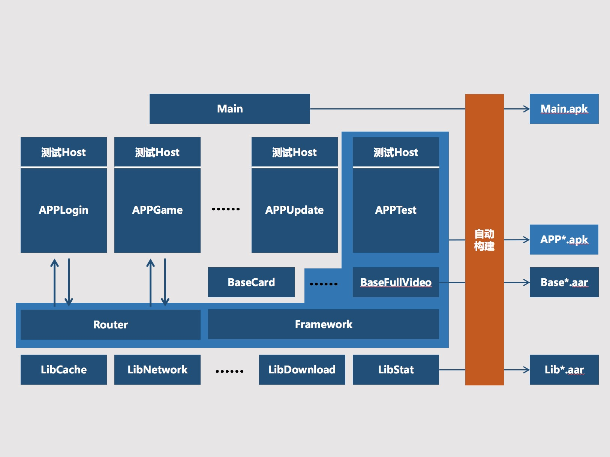

# Readhub-Android

## 项目简介

- 应用介绍

	**该应用非无码科技官方产品，仅是基于个人兴趣开发的一款浏览Readhub内容的Android应用。app内所有资讯内容均来自无码科技产品 Readhub。**

- Readhub 介绍：
 
	Readhub 是无码科技团队的一个副产品。这个产品有什么用？每天花几分钟了解一下互联网行业里发生的事情。行业里，每天值得关注的事情，可能并不超过 5 件，其他的信息都是可读可不读的。无码科技团队想通过技术和产品的手段，把每天获取资讯这个事情做得优雅一点。

	以上内容均来自微信公众号「小道消息」，关于 Readhub 的更多介绍，可以点击链接[无码科技发布第一款产品](https://mp.weixin.qq.com/s?__biz=MjM5ODIyMTE0MA==&mid=2650969398&idx=1&sn=70c44b9bb994d9a8d98453b97555890b&chksm=bd38310d8a4fb81b878d2a252e813b304873412d2131d7e4787efb52f68ca8676eaad89bd245&scene=0&key=afcd625aa1116852d5c1c05e8cc727fbb36dd1a1b29b2d479b7102b73bafb061942b0a8684a5d01354a97047e79d47a8f18b6757d69cfc201f1088dbe061eef3a801718c08ecf740af13f55f3f3e7e65&ascene=0&uin=OTk0NDIyNDgw&devicetype=iMac14%2C2+OSX+OSX+10.12.4+build(16E195)&version=12020610&nettype=WIFI&fontScale=100&pass_ticket=z4VWnrxOnq2HBP%2BrcsexXO%2F5kXUdPvn9hiTeEgb9DUGwzmC8y%2BNyqBW3b9SjanRq) 查看！

## 产品体验

### 下载地址

- 扫码下载

	

- 直接下载

	[https://github.com/bihe0832/readhub-android/blob/master/demo/readhub_release_newer.apk?raw=true](https://github.com/bihe0832/readhub-android/blob/master/demo/readhub_release_newer.apk?raw=true)

### 应用效果

- 首页热门话题：

	

- 话题详情

	

- 首页资讯：
	
	

- 首页我的：
	
	

## 开发体验

### 运行方法

开发中版本，暂无完整版本的体验运行方法。如果想体验开发中版本，请参考本人博客：[终端基于gradle的开源项目运行环境配置指引](
http://blog.bihe0832.com/android-as-gradle-config.html)

### 框架介绍

新版本采用模块化来开发。具体框架后续会陆续补充。下面附上完整的框架图，目前readhub使用了一个部分阉割的框架：

### 代码目录
	.
	├── Framework_core			：框架核心层
	├── Lib*				：基础框架层
	├── Main				：应用开发层
	├── README.md				：项目介绍
	├── build.conf				：自动构建配置文件
	├── build.sh				：自动构建脚本
	├── build_lib.sh			：基础框架层生成maven构建脚本
	├── build_maven.gradle			：基础框架层生成maven构建依赖
	├── config.gradle			：项目工程、构建、版本号等配置
	├── demo				：demo展示相关文件
	└── libs				：本地maven目录

## Api介绍

开发中使用到了多个readhub官方的api，为了方便后续的开发者，简单整理如下：

### 热门话题列表

- URL: https://api.readhub.me/topic

- 参数：

	- lastCursor：上一页数据最后一个话题的order，首次传空
	- pageSize：一次请求拉取的话题数目

- 请求事例：

		https://api.readhub.me/topic?pageSize=1&lastCursor=
		
		https://api.readhub.me/topic?pageSize=10&lastCursor=39311

### 话题详情

- URL: https://api.readhub.me/topic/话题id

- 请求事例：

		https://api.readhub.me/topic/4djhWVo81n9
		
### 科技动态

- URL: https://api.readhub.me/news

- 参数：
	
	- lastCursor：上一次访问的最后一条资讯的PublishDate对应的毫秒时间戳
	- pageSize：一次请求拉取的话题数目

- 请求事例：

		https://api.readhub.me/news?pageSize=1&lastCursor=
		
		https://api.readhub.me/news?pageSize=1&lastCursor=1519477905000

### 开发者资讯

- URL: https://api.readhub.me/technews

- 参数：

	- lastCursor：上一次访问的最后一条资讯的PublishDate对应的毫秒时间戳
	- pageSize：一次请求拉取的话题数目

- 请求事例：

		https://api.readhub.me/technews?pageSize=1&lastCursor=
		
		https://api.readhub.me/technews?pageSize=10&lastCursor=1519477905000

### 区块链资讯

- URL: https://api.readhub.me/blockchain

- 参数：

	- lastCursor：上一次访问的最后一条资讯的PublishDate对应的毫秒时间戳
	- pageSize：一次请求拉取的话题数目

- 请求事例：

		https://api.readhub.me/blockchain?pageSize=1&lastCursor=
		
		https://api.readhub.me/blockchain?pageSize=5&lastCursor=1519477905000
